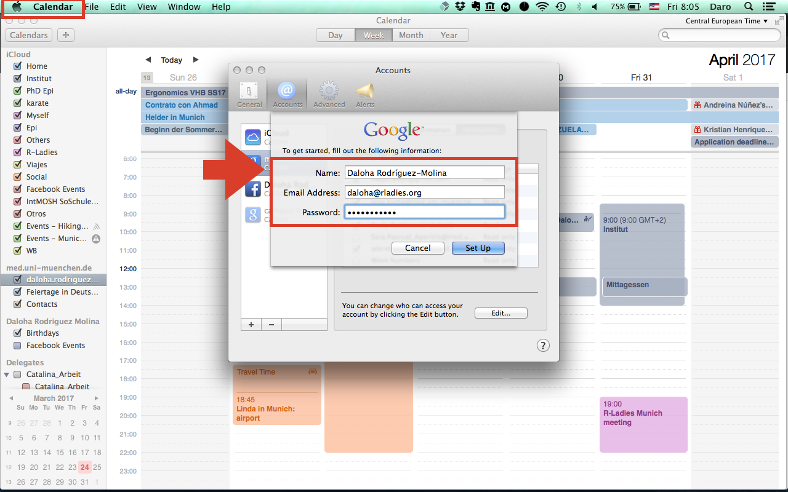

##### This is a short tutorial on how to integrate Google Calendar with our ladies.org email account, and how to further connect it and manage it from the Calendar app on mac.

### 1. Go to [calendar.google.com](calendar.google.com)     
     
### 2. Click on Create Account:

### 3. Click on "I prefer to use my current email address." Fill out the information, including your rladies.org email account where needed.

### 4. Go to your rladies.org email inbox and follow the instructions on the confirmation email.

### 5. Google will welcome you, and you can check that you're using your rladies.org email account:

### 6. Follow these steps to link your rladies.org Google Calendar account with Apple's Calendar App:

### 7. This image corresponds to step 6 of the previous image (please ignore the previous calendar I had for R-Ladies, which was from my personal email account):

### 8. You can now see that your rladies.org Calendar is already linked with Apple's Calendar app, and you can use it from there:

## Notes:
* You can totally use Google Calendar's web interface if you want to.
* I know that you can totally sync Apple's Calendar with your Calendar app on iPhone. I also know that Google Calendar has its own mobile app. No idea how to sync it with other calendar applications.

