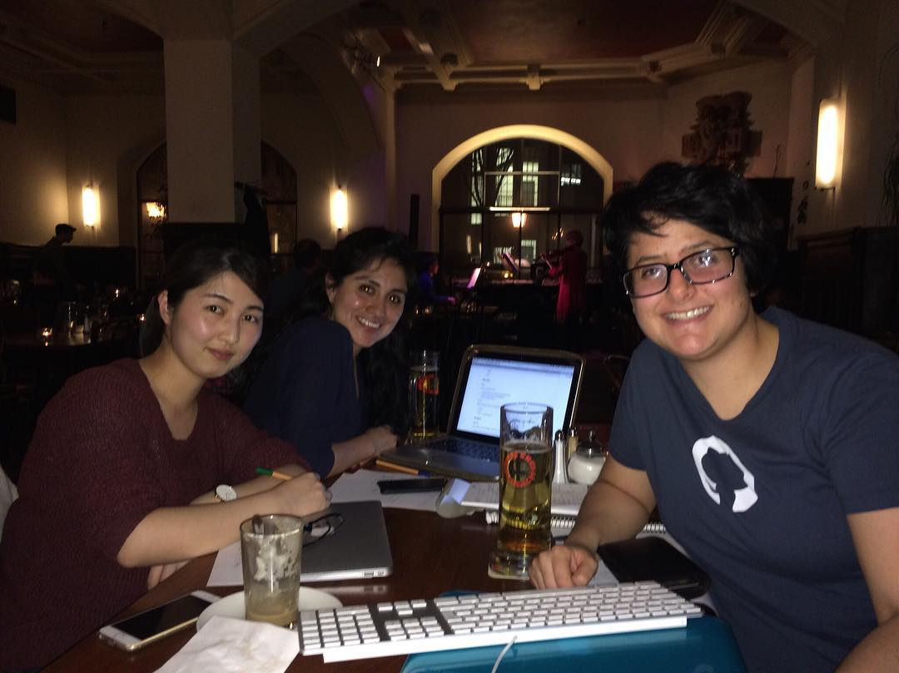

# R-Ladies Munich kickoff meeting (21.03.2017)
by Daloha Rodr&iacute;guez-Molina - March 23, 2017

# The very first R-Ladies Munich meeting!

### General info

* **Where**: Café am Beethovenplatz, Goethestr. 51 80336 München    
* **When**: 21.03.2017 @ 7pm     
* **Who**: Pamela Matías, Dan Huang, Daloha Rodríguez-Molina     
* **Who was missing**: Maggie Heiden Chak - she had class and couldn't make it.

### Summary

1. We set up a new master password for our email account munich@rladies.org, so that all of us can remember it and have access to it.

2. We set up the [meetup group](www.meetup.com/rladies-munich) using the munich email and the master password.

  *  **About the meetup fee**: Daro paid the initial 6-month fee. We decided not to split the money just yet, but to ask for the R-Consortium grant to cover the expenses of the meetup fee.
  
  *  **About the meetup information**: We started with a short description found in the [R-Ladies Austin](https://www.meetup.com/rladies-austin/) meetup group. The plan is to improve it in the following days, and also include some info in German taken from the [R-Ladies Berlin](www.meetup.com/rladies-berlin) group (Daro checked with them and they are totally okay with it).
  
4. We set up the [twitter](www.twitter.com/RLadiesMunich) account, using the same info.

5. We set up an [instagram](https://www.instagram.com/rladiesmunich/) account, using the same info.

6. We ran an initial survey on the three of us. The survey was taken and modified from [R-Ladies DC](https://www.meetup.com/rladies-dc/), who at the same time took it from [R-Ladies Nashville](https://www.meetup.com/rladies-nashville/). The original survey can be found [here](https://kellyo.typeform.com/to/inkRZz), and our modified survey can be found [here](https://rladiesmunich.typeform.com/to/c46YCG).

7. We talked about potential sponsors (check more info below).

8. We talked about potential venues (checl more info below).

9. We talked about collaboration with other local groups, e.g. [PyLadies Munich](https://www.meetup.com/PyLadiesMunich/) and the [Applied R Munich](https://www.meetup.com/Applied-R-Munich/) group.

10. We talked about how to promote R-Ladies Munich (check more info below).

11. Daloha is working on a logo for R-Ladies Munich. In the meantime, we're using the general one.

### Accounts and handles:

* Main email: munich@rladies.org
* Personal emails:
    * daloha@rladies.org
    * pamela@ladies.org
    * dan@rladies.org
    * maggie@rladies.org
* Meetup: [www.meetup.com/rladies-munich](www.meetup.com/rladies-munich)
* Twitter: @[RLadiesMunich](www.meetup.com/rladies-munich)
* Instagram: @[rladiesmunich](https://www.instagram.com/rladiesmunich/)

### Potential sponsors and who will contact them:

Sponsor               | What for?               | Who will contact them?
----------------------|-------------------------|-----------------------
[R Consortium](https://www.r-consortium.org/projects/r-user-group-support-program) | Financial Support | Pamela
[Netlight GmbH](https://www.netlight.com/) | Venue | Daloha
[Münchner R Kurse](http://www.muenchner-r-kurse.de/) | Beverages? | Daloha
[Lehre@LMU](http://www.uni-muenchen.de/studium/lehre_at_lmu/index.html) | Financial support | Daloha
[Wayra](http://wayra.co/en/) | Financial support | Pamela

### Potential venues: (also depends on the results of the initial survey)
* Netlight GmbH
* Main building of the LMU (check with the people from the [Applied R Munich](https://www.meetup.com/Applied-R-Munich/) group).
* Library of the Institute for Occupational Medicine of the LMU Hospital? (only for <20 people, or social events).

### Collaboration with other local groups:
* [PyLadies Munich](https://www.meetup.com/PyLadiesMunich/)
* [Applied R Munich](https://www.meetup.com/Applied-R-Munich/)

### How to promote R-Ladies Munich?
* Social Media
* Face-to-face (and mailing list?) at the Helmholtz Zentrum.
* Face-to-face (and mailing list?) at the IBE (ask for Ms. Thomas' and Ms. Langguth's help).

### First meetup
* **Potential date**: Wednesday 26.04.2017
* **Potential topic**: TBD based on the results of the initial survey.
* **Potential venue**: TBD

### We *won't* be in Munich the following dates:
* **Dan**: 24.03.2017 - 04.04.2017
* **Pamela**: 04.04.2017 - 25.04.2017
* **Daloha**: 27.04.2017 - 29.05.2017

### Next steps:
* Customize appearance of meetup group
* Finish draft of the logo (after the first draft, Pamela will ask some profis to improve it)
* Contact sponsors
* Write script for initial survey (or fork it and adapt it from the [R-Ladies Nashville GitHub repo](https://github.com/rladies-nashville/kickoff-survey/blob/gh-pages/kickoff_survey.Rmd)).
* Next meeting: Friday 31.03.2017 @ 7pm. We still haven't decided on the place.