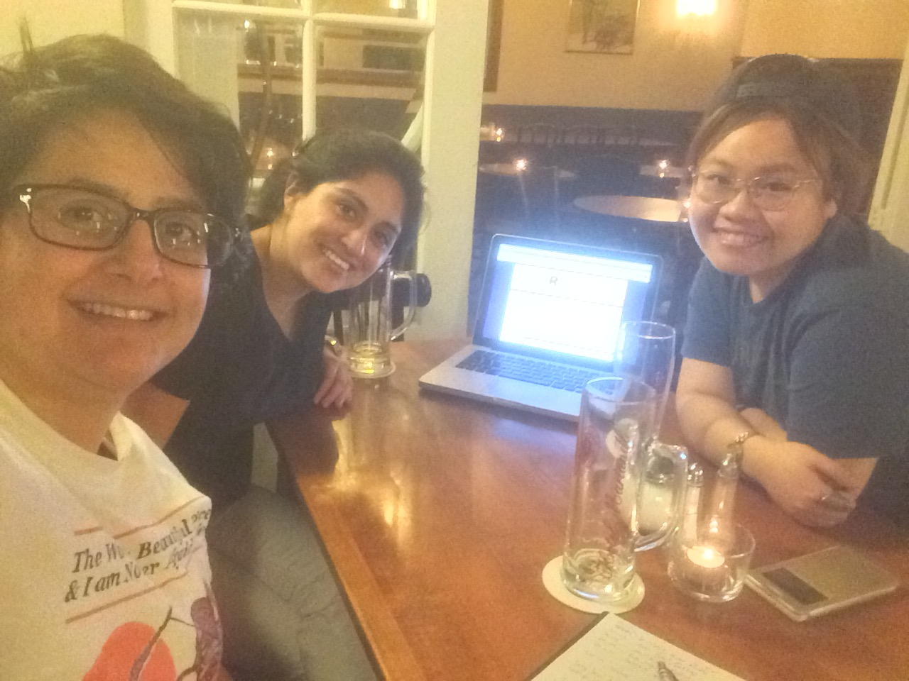

# R-Ladies Munich second meeting (31.03.2017)
by Daloha Rodr&iacute;guez-Molina - April 04, 2017

# This is our second R-Ladies Munich meeting!

### General info

* **Where**: Café am Beethovenplatz, Goethestr. 51 80336 München    
* **When**: 31.03.2017 @ 6:30pm     
* **Who**: Pamela Matías, Maggie Heiden Chak, Daloha Rodríguez-Molina     
* **Who was missing**: Dan Huang - she is currently in Japan.

### Agenda:
1. R-Ladies Munich Logo
2. Sponsors
3. Decide on a date for our first meetup event
4. Brainstorm ideas for first meetup topic
5. Promotion actions
6. Other things to do

### Summary

#### 1. R-Ladies Munich Logo 
Daloha sent a draft (it's on the munich channel on Slack). Pam will forward it along with some ideas to the graphic designers.

#### 2. Sponsors' status:

Sponsor       | Status
--------------|---------------------------------------------------
[R Consortium](https://www.r-consortium.org/projects/r-user-group-support-program) | Pamela already filled out the application. We're waiting for their response.
[Stylight](https://www.stylight.com/About/Contact/) | They offered us hosting events. Daloha is asking about the last details.
[Münchner R Kurse](http://www.muenchner-r-kurse.de/) | The webpage does not exist. We could not contact them
[Lehre@LMU](http://www.uni-muenchen.de/studium/lehre_at_lmu/index.html) | Daloha sent them an email on 31.03.2017. Waiting for response
[Wayra](http://wayra.co/en/) | Pamela contacted them about the venue, and they're also interested in hosting our events. Pamela is asking about the last details.

#### 3. Decide on a date for our first meetup event: 
April 26th, 2017 / 18:30 - 21:30 / Venue pending. 
Do not announce the event on meetup until we have decided on the venue.
  
#### 4. Brainstorm ideas for first meetup topic:
* **Social get-together**: Not our best idea. We believe most of the members will be eager to start doing R things, so we'd like to go for a workshop or tutorial.
* **Github + Rmarkdown**: Daloha will prepare a short tutorial on Github and Rmarkdown. She will work on the presentation and learning strategies next week, and will have it ready by the next meeting. It'd be nice to get name tag stickers ["HELLO MY NAME IS"](https://www.amazon.de/Aufkleber-Namensschilder-Hello-ohne-Rolle/dp/B0124GOZKS/ref=pd_sbs_21_3?_encoding=UTF8&psc=1&refRID=HVQ4ZSQPBHNZP4K1BWP6).
* **The rough outline of the session is as follows**:

Time          | Activity
--------------|--------------------------------------
18:30 - 18:45 | Socializing, meet & greet
18:45 - 19:00 | Welcome presentation: who are we and why did we found R-Ladies Munich?
19:00 - 19:30 | Crash course Github (+ RStudio)
19:30 - 20:00 | Exercise about Github / Setting up accounts / Q&A
20:00 - 20:30 | Crash course Rmarkdown
20:30 - 21:00 | Exercise about Rmarkdown / Q&A
21:00 - 21:30 | Socializing

#### 5. Promotion actions:
* **Initial survey**: we have 7/33 so far. Send reminders. Check out the analysis script from R-Ladies Nashville(?)
* **IBE/LMU**: Pamela will contact them on Monday with the sample email to ask their support in promoting our group.
* **HZ**: Pam will contact her boss to see if they can support us promoting our group on their mailing list.
* **Other potential sponsors**: [German Entrepreneurship GmbH](http://www.german-entrepreneurship.de/en/urship.de/de/), [TrustYou](http://www.trustyou.com)

#### 6. Other things to do:
* Contact potential speakers from the area. Come up with a list of speakers for possible future talks. Check out list for R ladies in Europe. Check out tweet from RLadies Berlin, one of the earliest tweets about somebody near Bodensee (Daloha will do this).
* Get stickers for R Studio - ask on Slack! 

### Summary of tasks:
* **Daloha**: first meetup presentation, finish contacting sponsors.
* **Pamela**: mailing stuff, logo people, finish contacting sponsors.
* **Next meeting**: Wed 12.04.2017. Possibly at Maggie's place. Topics to cover: presentation, venue, sponsor status, last details for first meetup 26.04.2017, set up meet up event. 
